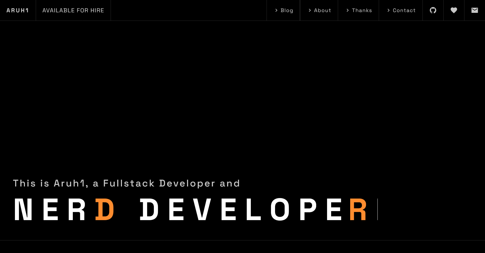

# aruh1.dev



## Description

This is the source for `aruh1.dev`, a personal website and blog by Rizki Pratama (Aruh1).

It includes a landing page, blog, shortlinks, newsletter subscription, RSS feed, sitemap, and generated Open Graph images.

## How to build it

Requirements:

- [Bun](https://bun.sh/) runtime & package manager

Install dependencies:

```sh
bun install
```

Start local development:

```sh
bun dev
```

Create a production build:

```sh
bun run build
```

Preview the production build locally:

```sh
bun run preview
```

Run the project checks:

```sh
bun run lint
```

## Deployment

Automated static deployment to [GitHub Pages](https://pages.github.com/) via GitHub Actions (`.github/workflows/deploy.yml`).

## What tech this website uses

- [Astro](https://astro.build/) for the site framework
- [Bun](https://bun.sh/) for fast runtime & package management
- [TypeScript](https://www.typescriptlang.org/) for typed scripts and routes
- [Tailwind CSS v4](https://tailwindcss.com/) for styling
- [GitHub Pages](https://pages.github.com/) for deployment
- [anime.js](https://animejs.com/) for motion
- [Satori](https://github.com/vercel/satori) and `sharp` for Open Graph image generation
- [unplugin-icons](https://github.com/unplugin/unplugin-icons) and Iconify for icons
