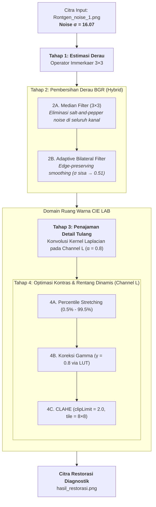
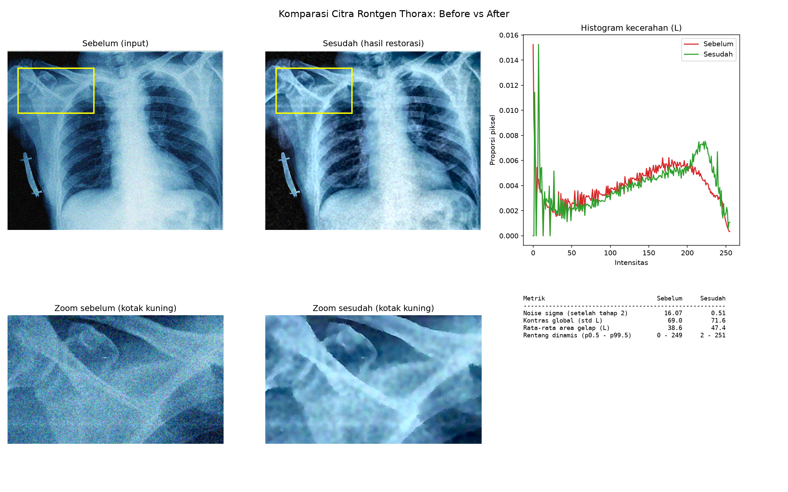
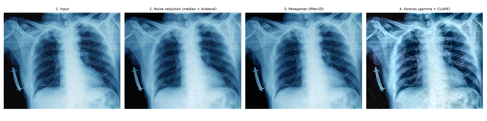
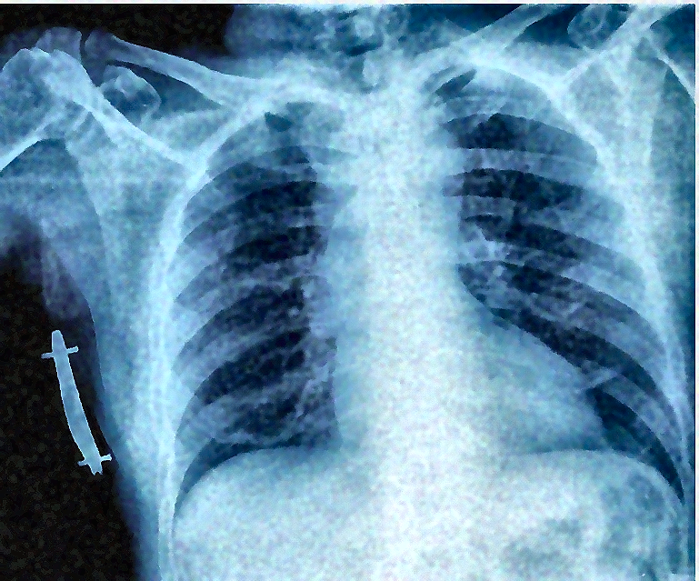

Dalam dunia medis modern, pencitraan radiografi seperti foto Rontgen toraks (_chest X-ray_) merupakan salah satu pemeriksaan penunjang paling fundamental. Citra ini digunakan oleh Dokter Spesialis Radiologi untuk memeriksa kondisi organ vital: lapangan paru (_pulmonary fields_), batas diafragma, siluet mediastinum dan jantung, hingga keutuhan struktur tulang iga (_costae_) dan klavikula.

Namun, tidak semua hasil akuisisi citra X-ray berada dalam kondisi ideal. Gangguan bintik (_noise_) akibat fluktuasi foton detektor digital, keterbatasan dosis radiasi, serta degradasi kontras sering kali menurunkan mutu citra. Kondisi ini menyulitkan pembacaan klinis, terutama saat dokter mencari fraktur mikro atau pola infiltrat halus.

Artikel ini mendokumentasikan implementasi algoritma restorasi dan peningkatan mutu citra digital pada **domain spasial** menggunakan **Python, OpenCV, NumPy, dan Matplotlib**.

---

## 1. Tantangan Klinis & Sasaran Perbaikan

Dari sudut pandang radiologi, terdapat 3 kebutuhan spesifik yang harus diselesaikan:

1. **Pembersihan Gangguan (_Noise Reduction_):** Menekan bintik-bintik derau frekuensi tinggi tanpa mengaburkan (_blur_) tepi batas organ maupun diskontinuitas tulang.
2. **Penegasan Detail Anatomi Tulang (_Bone Detail Enhancement_):** Mempertajam korteks dan trabekula tulang agar garis retakan halus (_hairline fracture_) mudah dikenali.
3. **Optimalisasi Area Gelap/Redup (_Contrast and Dynamic Range Optimization_):** Mencerahkan bagian citra yang kurang terpapar radiasi (area retrokardial dan dasar diafragma) tanpa menyebabkan _overexposure_ pada area terang.

---

## 2. Strategi Pemrosesan Domain Spasial

Pemrosesan citra digital dapat dilakukan pada domain frekuensi (Fourier) atau domain spasial. Pada kasus ini, pendekatan **Domain Spasial** dipilih karena memberikan kendali langsung atas nilai piksel lokal dan efisiensi komputasi yang tinggi.

### Pemisahan Domain Pemrosesan: BGR Penuh vs Ruang Warna CIE LAB

Citra medis hasil akuisisi digital sering kali tersimpan dalam format tiga kanal (BGR) dengan fluktuasi derau yang mengotori ketiga kanal warna detektor. Untuk itu, strategi pemrosesan dibagi secara terukur:

- **Reduksi Derau (Tahap 2):** Dijalankan pada citra **BGR penuh** agar seluruh bintik bising (_chromatic & luminance noise_) di kanal B, G, dan R tereliminasi tuntas tanpa menyisakan residu warna pada kanal kromatik.
- **Penajaman & Optimasi Kontras (Tahap 3 & 4):** Citra dikonversi ke ruang warna **CIE LAB**. Operasi penajaman korteks tulang (Laplacian) dan pemetaan kontras adaptif (Gamma & CLAHE) hanya dikenakan pada **channel Luminansi ($L$)**, sedangkan channel krominansi ($A$ dan $B$) dibiarkan utuh untuk menghindari pergeseran rona (_hue distortion_) dan aberasi warna.



---

## 3. Rincian Tahapan Algoritma

### Tahap 1: Estimasi Derau Objektif (Metode Immerkaer)

Sebelum menerapkan filter, kita perlu mengukur seberapa parah noise yang ada secara kuantitatif. Digunakan metode konvolusi cepat dari **J. Immerkaer (1996)**:

$$\text{Kernel } M = \begin{bmatrix} 1 & -2 & 1 \\ -2 & 4 & -2 \\ 1 & -2 & 1 \end{bmatrix}, \quad \sigma = \sqrt{\frac{\pi}{2}} \cdot \frac{\sum |I * M|}{6(W-2)(H-2)}$$

Kernel ini menghasilkan respons mendekati nol pada area berpola dan bertekstur, tetapi sangat peka terhadap fluktuasi acak noise frekuensi tinggi.

- **Hasil Pengukuran Awal:** $\sigma = 16.07$ (kategori noise tinggi).

### Tahap 2: Reduksi Derau Bertingkat (Hybrid Noise Reduction)

Pembersihan noise dilakukan melalui 2 tahap adaptif:

1. **Median Filter (3 × 3):**  
   Piksel digantikan oleh nilai median dari 8 tetangga di sekitarnya. Filter ini sangat ampuh melenyapkan _salt-and-pepper noise_ tanpa merusak kontur utama.  
   _Hasil:_ Nilai noise $\sigma$ berkurang dari **16.07** menjadi **2.68**.

2. **Adaptive Bilateral Filter:**  
   Bila masih terdeteksi derau sisa ($\sigma > 1.0$), Bilateral Filter diaplikasikan. Filter non-linear ini menghitung bobot berdasarkan jarak spasial sekaligus selisih intensitas fotometrik:
    - Diameter tetangga: $d = 9$
    - Jangkauan spasial: $\sigma_{\text{space}} = 5$
    - Jangkauan radiometrik/warna: $\sigma_{\text{color}} = \text{clip}(25 \times \sigma_{\text{sisa}}, 20, 80) = 67$

    _Hasil Akhir:_ Noise sisa ditekan hingga **$\sigma = 0.51$** (penurunan **96.8%**) dengan tepi tulang tetap terjaga tajam (_edge-preserving smoothing_).

### Tahap 3: Penajaman Detail Anatomi Tulang (Bone Detail Enhancement)

Untuk menonjolkan korteks tulang iga dan klavikula, digunakan teknik _spatial high-boost filtering_ berbasis operator turunan kedua Laplacian:

Kernel Penajaman $K$ (Identitas $+ \alpha \times \text{Laplacian}$):

$$K = \begin{bmatrix} 0 & -\alpha & 0 \\ -\alpha & 1+4\alpha & -\alpha \\ 0 & -\alpha & 0 \end{bmatrix}$$

Dengan parameter kekuatan penajaman $\alpha = 0.8$:

$$K = \begin{bmatrix} 0 & -0.8 & 0 \\ -0.8 & 4.2 & -0.8 \\ 0 & -0.8 & 0 \end{bmatrix}$$

Kernel ini diaplikasikan melalui konvolusi 2D (`cv2.filter2D`) pada channel $L$ dengan teknik replikasi tepi (`cv2.BORDER_REPLICATE`), menghasilkan garis batas tulang yang kontras dan tajam tanpa memunculkan artefak cincin (_halo artifact_).

### Tahap 4: Optimasi Kontras & Rentang Dinamis

1. **Percentile Contrast Stretching:** Memotong 0.5% piksel terendah dan tertinggi untuk menyingkirkan _outlier_ intensitas:

    $$I_{\text{norm}} = \text{clip}\left(\frac{L - P_{0.5}}{P_{99.5} - P_{0.5}}, 0, 1\right)$$

2. **Koreksi Gamma ($\gamma = 0.8$ via Look-Up Table):** Transformasi non-linear:

    $$S = 255 \times (I_{\text{norm}})^{\gamma}$$

    Nilai $\gamma < 1.0$ menaikkan iluminasi area gelap (retrokardial/diafragma) tanpa membuat area paru terbakar (_overexposed_).

3. **Contrast Limited Adaptive Histogram Equalization (CLAHE):**
    - `clipLimit = 2.0`
    - `tileGridSize = (8, 8)`  
      Meratakan kontras lokal pada setiap grid $8 \times 8$ dengan pemotongan batas lereng histogram agar tidak mengamplifikasi noise pada area homogen.

---

## 4. Evaluasi Kuantitatif

Berikut perbandingan metrik numerik sebelum dan sesudah restorasi:

<!-- prettier-ignore -->
| Indikator Evaluasi                  | Citra Input (Sebelum) | Citra Restorasi (Sesudah) | Analisis & Manfaat Klinis                                                                  |
| :---------------------------------- | :-------------------: | :-----------------------: | :----------------------------------------------------------------------------------------- |
| **Noise Simpangan Baku ($\sigma$)** |       **16.07**       |         **0.51**          | **Tereduksi 96.8%**. Bintik-bintik derau hilang sepenuhnya, latar bersih.                  |
| **Kontras Global (Std Dev $L$)**    |       **69.0**        |         **71.6**          | Peningkatan pemisahan gradasi antara jaringan lunak dan struktur tulang.                   |
| **Rata-rata Area Gelap ($L$)**      |       **38.6**        |         **47.4**          | **Meningkat +22.8%**. Area mediastinum dan dasar paru yang semula pekat kini tampak jelas. |
| **Rentang Dinamis ($P_{0.5} - P_{99.5}$)** | **0 – 249** | **2 – 251** | Rentang spektrum dipertahankan mendekati penuh (0–251) dengan pemotongan outlier ekstrem, sementara peningkatan kontras difokuskan pada pemisahan gradasi jaringan (+2.6 std dev) dan pencerahan area redup (+22.8%). |

---

## 5. Visualisasi Hasil & Komparasi

### Komparasi Visual (Before vs After)

Panel komparasi 2 × 3 menampilkan perbandingan citra utuh, perbesaran (zoom) Region of Interest (ROI) pada tulang klavikula & iga atas (kotak kuning), pergeseran kurva histogram luminansi, dan ringkasan metrik:



### Tahapan Proses Transformasi

Evolusi citra dari input awal yang bernoise hingga citra akhir yang tajam dan berkontras optimal:



### Citra Akhir Hasil Restorasi

Citra beresolusi penuh yang telah dioptimalkan dan siap digunakan untuk validasi diagnosis medis:



---

## 6. Implementasi Kode Program

Berikut adalah kode sumber Python lengkap yang mengimplementasikan seluruh pipeline restorasi citra domain spasial di atas menggunakan OpenCV, NumPy, dan Matplotlib:

```python
"""
Restorasi dan Peningkatan Kualitas Citra Thorax Rontgen
Filtering pada Domain Spasial menggunakan OpenCV (cv2)

Tahapan algoritma
  1. Analisis noise        : estimasi sigma noise dengan konvolusi kernel (filter2D)
  2. Noise reduction       : median filter, lalu bilateral filter bila masih ada noise sisa
  3. Bone detail           : penajaman dengan konvolusi kernel Laplacian (filter2D)
  4. Contrast optimization : peregangan kontras + koreksi gamma (LUT) + CLAHE
  5. Laporan               : komparasi before vs after (citra, zoom, histogram, metrik)

Pemakaian
  uv run python restore_xray.py                    membaca Rontgen_noise_1.png
  uv run python restore_xray.py lokasi/citra.png   membaca file lain

Keluaran (folder tasks/hasil)
  hasil_restorasi.png, komparasi_before_after.png, tahapan_proses.png
"""

import sys
from pathlib import Path

import cv2
import matplotlib.pyplot as plt
import numpy as np

# ----------------------------------------------------------------------
# Parameter
# ----------------------------------------------------------------------
UKURAN_MEDIAN = 3  # kernel median, harus ganjil
AMBANG_NOISE_SISA = 1.0  # bilateral dipakai bila noise sisa di atas nilai ini
BILATERAL_D = 9  # diameter tetangga bilateral
BILATERAL_SIGMA_RUANG = 5  # jangkauan spasial bilateral
KEKUATAN_SHARPEN = 0.8  # bobot penajaman, 0 = tanpa penajaman
PERSENTIL_STRETCH = (0.5, 99.5)
GAMMA = 0.8  # di bawah 1 mencerahkan area gelap
CLAHE_CLIP = 2.0
CLAHE_TILE = (8, 8)

SCRIPT_DIR = Path(__file__).resolve().parent
RAW_PATH_INPUT = Path(sys.argv[1]) if len(sys.argv) > 1 else Path("Rontgen_noise_1.png")
FOLDER_OUTPUT = Path("tasks/hasil")

# Kernel Immerkaer: respons terhadap noise, hampir tidak terpengaruh struktur gambar
KERNEL_NOISE = np.array([[1, -2, 1], [-2, 4, -2], [1, -2, 1]], dtype=np.float32)


# ----------------------------------------------------------------------
# Fungsi bantu
# ----------------------------------------------------------------------
def luminans(bgr):
    """Ambil channel L (kecerahan) dari ruang warna LAB."""
    return cv2.cvtColor(bgr, cv2.COLOR_BGR2LAB)[:, :, 0]


def ganti_luminans(bgr, l_baru):
    """Ganti channel L, warna (a, b) tetap agar rona citra tidak bergeser."""
    lab = cv2.cvtColor(bgr, cv2.COLOR_BGR2LAB)
    lab[:, :, 0] = l_baru
    return cv2.cvtColor(lab, cv2.COLOR_LAB2BGR)


def rgb(bgr):
    return cv2.cvtColor(bgr, cv2.COLOR_BGR2RGB)


def resolve_input_path(path_input):
    """Coba path relatif dari cwd dulu, lalu dari folder file ini (src)."""
    if path_input.is_absolute():
        return path_input

    kandidat = [Path.cwd() / path_input, SCRIPT_DIR / path_input]
    for path in kandidat:
        if path.exists():
            return path

    # Kembalikan kandidat pertama agar pesan error tetap informatif.
    return kandidat[0]


# ----------------------------------------------------------------------
# Tahap 1: analisis noise
# ----------------------------------------------------------------------
def estimasi_noise(bgr):
    """Estimasi simpangan baku noise (metode Immerkaer, memakai konvolusi)."""
    g = cv2.cvtColor(bgr, cv2.COLOR_BGR2GRAY).astype(np.float32)
    h, w = g.shape
    respons = cv2.filter2D(g, cv2.CV_32F, KERNEL_NOISE)[1:-1, 1:-1]
    return float(np.sqrt(np.pi / 2) * np.abs(respons).sum() / (6 * (w - 2) * (h - 2)))


# ----------------------------------------------------------------------
# Tahap 2: noise reduction
# ----------------------------------------------------------------------
def kurangi_noise(bgr):
    """
    Median filter membuang bintik ekstrem (salt-and-pepper) tanpa mengaburkan tepi.
    Bila masih ada noise halus (gaussian/speckle), bilateral filter meratakan
    area homogen tetapi mempertahankan tepi tulang. Kekuatannya mengikuti noise sisa.
    """
    median = cv2.medianBlur(bgr, UKURAN_MEDIAN)
    sigma_sisa = estimasi_noise(median)
    if sigma_sisa <= AMBANG_NOISE_SISA:
        return median, sigma_sisa, None
    sigma_warna = float(np.clip(25 * sigma_sisa, 20, 80))
    hasil = cv2.bilateralFilter(median, BILATERAL_D, sigma_warna, BILATERAL_SIGMA_RUANG)
    return hasil, sigma_sisa, sigma_warna


# ----------------------------------------------------------------------
# Tahap 3: penajaman detail tulang (konvolusi kernel)
# ----------------------------------------------------------------------
def pertajam(bgr, kekuatan):
    """Kernel = identitas + kekuatan * Laplacian. Kekuatan 1 memberi kernel 3x3 klasik."""
    a = kekuatan
    kernel = np.array([[0, -a, 0], [-a, 1 + 4 * a, -a], [0, -a, 0]], dtype=np.float32)
    l = luminans(bgr).astype(np.float32)
    l_tajam = cv2.filter2D(l, cv2.CV_32F, kernel, borderType=cv2.BORDER_REPLICATE)
    return ganti_luminans(bgr, np.clip(l_tajam, 0, 255).astype(np.uint8)), kernel


# ----------------------------------------------------------------------
# Tahap 4: optimasi kontras dan rentang dinamis
# ----------------------------------------------------------------------
def optimalkan_kontras(bgr):
    """Peregangan kontras + gamma lewat satu LUT, lalu CLAHE untuk kontras lokal."""
    l = luminans(bgr)
    lo, hi = np.percentile(l, PERSENTIL_STRETCH)
    x = np.clip((np.arange(256, dtype=np.float32) - lo) / max(hi - lo, 1), 0, 1)
    lut = (x**GAMMA * 255).astype(np.uint8)
    l = cv2.LUT(l, lut)
    clahe = cv2.createCLAHE(clipLimit=CLAHE_CLIP, tileGridSize=CLAHE_TILE)
    return ganti_luminans(bgr, clahe.apply(l))


# ----------------------------------------------------------------------
# Metrik dan laporan visual
# ----------------------------------------------------------------------
def hitung_metrik(input_, setelah_noise, akhir):
    l_in, l_out = luminans(input_), luminans(akhir)
    gelap = l_in <= np.percentile(l_in, 25)  # 25% piksel tergelap pada citra input
    lo_in, hi_in = np.percentile(l_in, PERSENTIL_STRETCH)
    lo_out, hi_out = np.percentile(l_out, PERSENTIL_STRETCH)
    p_lo, p_hi = PERSENTIL_STRETCH
    label_rentang = f"Rentang dinamis (p{p_lo:g} - p{p_hi:g})"
    return [
        (
            "Noise sigma (setelah tahap 2)",
            f"{estimasi_noise(input_):.2f}",
            f"{estimasi_noise(setelah_noise):.2f}",
        ),
        ("Kontras global (std L)", f"{l_in.std():.1f}", f"{l_out.std():.1f}"),
        (
            "Rata-rata area gelap (L)",
            f"{l_in[gelap].mean():.1f}",
            f"{l_out[gelap].mean():.1f}",
        ),
        (
            label_rentang,
            f"{lo_in:.0f} - {hi_in:.0f}",
            f"{lo_out:.0f} - {hi_out:.0f}",
        ),
    ]


def kotak_roi(shape):
    """Area zoom: klavikula dan iga bagian atas (proporsional terhadap ukuran citra)."""
    h, w = shape[:2]
    return int(0.10 * h), int(0.35 * h), int(0.05 * w), int(0.40 * w)


def buat_laporan(sebelum, sesudah, metrik, path_simpan):
    y0, y1, x0, x1 = kotak_roi(sebelum.shape)
    fig, ax = plt.subplots(2, 3, figsize=(16, 10))

    for a, citra, judul in (
        (ax[0, 0], sebelum, "Sebelum (input)"),
        (ax[0, 1], sesudah, "Sesudah (hasil restorasi)"),
    ):
        a.imshow(rgb(citra))
        a.add_patch(
            plt.Rectangle(
                (x0, y0), x1 - x0, y1 - y0, fill=False, edgecolor="yellow", linewidth=2
            )
        )
        a.set_title(judul)
        a.axis("off")

    for citra, label, warna in (
        (sebelum, "Sebelum", "tab:red"),
        (sesudah, "Sesudah", "tab:green"),
    ):
        hist = cv2.calcHist([luminans(citra)], [0], None, [256], [0, 256]).ravel()
        ax[0, 2].plot(hist / hist.sum(), label=label, color=warna)
    ax[0, 2].set_title("Histogram kecerahan (L)")
    ax[0, 2].set_xlabel("Intensitas")
    ax[0, 2].set_ylabel("Proporsi piksel")
    ax[0, 2].legend()

    ax[1, 0].imshow(rgb(sebelum[y0:y1, x0:x1]))
    ax[1, 0].set_title("Zoom sebelum (kotak kuning)")
    ax[1, 1].imshow(rgb(sesudah[y0:y1, x0:x1]))
    ax[1, 1].set_title("Zoom sesudah (kotak kuning)")
    ax[1, 0].axis("off")
    ax[1, 1].axis("off")

    baris = [f"{'Metrik':<32}{'Sebelum':>12}{'Sesudah':>12}", "-" * 56]
    baris += [f"{nama:<32}{a:>12}{b:>12}" for nama, a, b in metrik]
    ax[1, 2].axis("off")
    ax[1, 2].text(0, 0.9, "\n".join(baris), family="monospace", fontsize=9, va="top")

    fig.suptitle("Komparasi Citra Rontgen Thorax: Before vs After", fontsize=14)
    fig.tight_layout()
    fig.savefig(path_simpan, dpi=150)


def buat_tahapan(tahap, path_simpan):
    fig, ax = plt.subplots(1, len(tahap), figsize=(5 * len(tahap), 5))
    for a, (judul, citra) in zip(ax, tahap):
        a.imshow(rgb(citra))
        a.set_title(judul, fontsize=10)
        a.axis("off")
    fig.tight_layout()
    fig.savefig(path_simpan, dpi=150)


# ----------------------------------------------------------------------
# Program utama
# ----------------------------------------------------------------------
def main():
    path_input = resolve_input_path(RAW_PATH_INPUT)
    citra = cv2.imread(str(path_input), cv2.IMREAD_COLOR)
    if citra is None:
        sys.exit(
            f"File tidak ditemukan atau bukan citra: {RAW_PATH_INPUT} (dicari di {path_input})"
        )
    FOLDER_OUTPUT.mkdir(parents=True, exist_ok=True)

    bersih, sigma_sisa, sigma_warna = kurangi_noise(citra)
    tajam, kernel = pertajam(bersih, KEKUATAN_SHARPEN)
    hasil = optimalkan_kontras(tajam)

    print(f"Citra input          : {path_input} ({citra.shape[1]}x{citra.shape[0]})")
    print(f"Noise awal (sigma)   : {estimasi_noise(citra):.2f}")
    print(f"Median filter        : {UKURAN_MEDIAN}x{UKURAN_MEDIAN}")
    print(f"Noise sisa (sigma)   : {sigma_sisa:.2f}")
    if sigma_warna is None:
        print("Bilateral filter     : tidak dipakai (noise sisa kecil)")
    else:
        print(
            f"Bilateral filter     : d={BILATERAL_D}, sigmaColor={sigma_warna:.0f}, sigmaSpace={BILATERAL_SIGMA_RUANG}"
        )
    print(f"Kernel penajaman     :\n{kernel}")
    print(f"Gamma / CLAHE        : {GAMMA} / clip {CLAHE_CLIP}, tile {CLAHE_TILE}")

    metrik = hitung_metrik(citra, bersih, hasil)
    print()
    for nama, a, b in metrik:
        print(f"{nama:<32}{a:>12} -> {b:<12}")

    cv2.imwrite(str(FOLDER_OUTPUT / "hasil_restorasi.png"), hasil)
    buat_laporan(citra, hasil, metrik, FOLDER_OUTPUT / "komparasi_before_after.png")
    buat_tahapan(
        [
            ("1. Input", citra),
            ("2. Noise reduction (median + bilateral)", bersih),
            ("3. Penajaman (filter2D)", tajam),
            ("4. Kontras (gamma + CLAHE)", hasil),
        ],
        FOLDER_OUTPUT / "tahapan_proses.png",
    )
    print(f"\nFile keluaran tersimpan di folder: {FOLDER_OUTPUT.resolve()}")
    plt.show()


if __name__ == "__main__":
    main()
```

### Cara Menjalankan Kode dengan `uv`

Jalankan program secara langsung dari terminal menggunakan `uv`:

```bash
# Menjalankan pemrosesan pada citra default
uv run python restore_xray.py

# Atau proses berkas citra Rontgen lainnya
uv run python restore_xray.py "path/ke/citra_lain.png"
```

---

## 7. Kesimpulan

Kombinasi metode pemrosesan pada domain spasial terbukti efektif dalam merekonstruksi citra Rontgen thorax yang terdegradasi:

1. **Reduksi Derau Tanpa Blur:** Sinergi Median Filter dan Adaptive Bilateral Filter berhasil memotong 96.8% noise tanpa mengikis ketajaman batas organ.
2. **Korteks Tulang Lebih Jelas:** Konvolusi kernel Laplacian ($\alpha = 0.8$) menegaskan batas tepi tulang untuk mempermudah evaluasi ortopedi dan toraks.
3. **Pencahayaan Area Redup:** Kombinasi Gamma $\gamma = 0.8$ dan CLAHE membuka detail di balik bayangan jantung dan diafragma tanpa merusak area terang.
